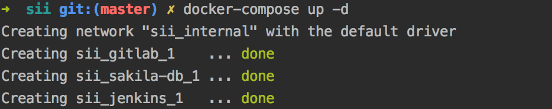
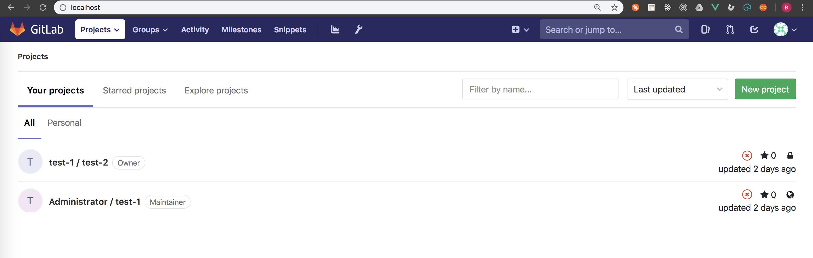
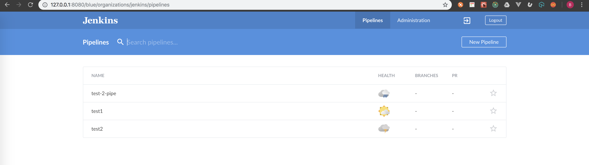
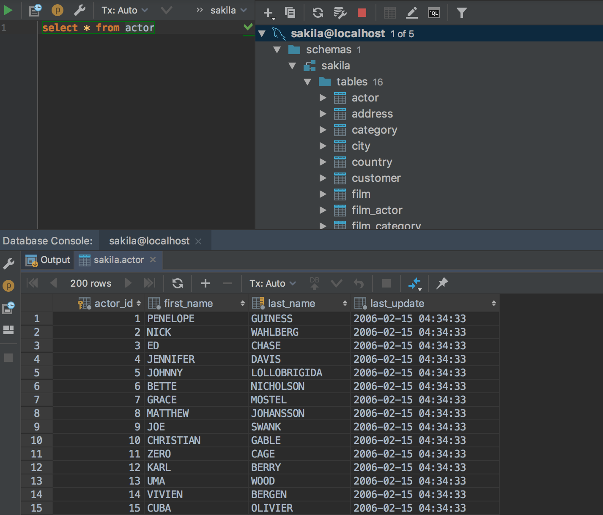
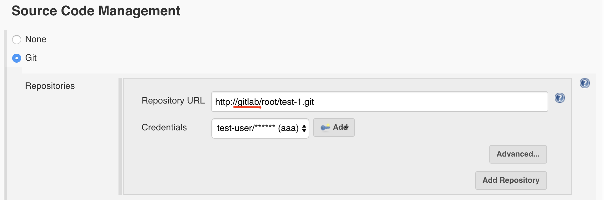
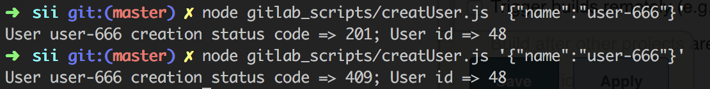

# docker-compose

Change volumes paths to your system path and make sure
those paths are added in docker settings

[source]
.docker-compose - gitlab
----
volumes:
      - /Users/zawadzkibartek/gitlab/config:/etc/gitlab
      - /Users/zawadzkibartek/gitlab/logs:/var/log/gitlab
      - /Users/zawadzkibartek/gitlab/data:/var/opt/gitlab
----

[source]
.docker-compose - jenkins
----
volumes:
      - /Users/zawadzkibartek/jenkins:/var/jenkins_home
      - /var/run/docker.sock:/var/run/docker.sock
----

[source]
.docker-compose - mysql
----
volumes:
      - /Users/zawadzkibartek/repos/sii/sakila-db:/docker-entrypoint-initdb.d
      - /Users/zawadzkibartek/mysql/datadir:/var/lib/mysql
----

then run -> `docker-compose up -d`

## URLS

GitLab -> 127.0.0.1:80

Jenkins -> 127.0.0.1:8080

MySQL -> jdbc:mysql://localhost:3306/sakila

containers are connected by network aliases so if you would like to
connect from jenkins to gitlab you can use alias in url
`http://gitlab/root/test-1.git` instead of localhost or 127.0.0.1

same from gitlab to jenkins and jenkins to mysql and mysql to gitlab

# GitLab - scripts

`/gitlab_scripts`

Install node.js and npm then run `npm install`
on `package.json`

if you want to create some users in gitlab type:

[source,javascript]
.createUser.js
----
node gitlab_scripts/creatUser.js '{"name":"user-666"}'
----

