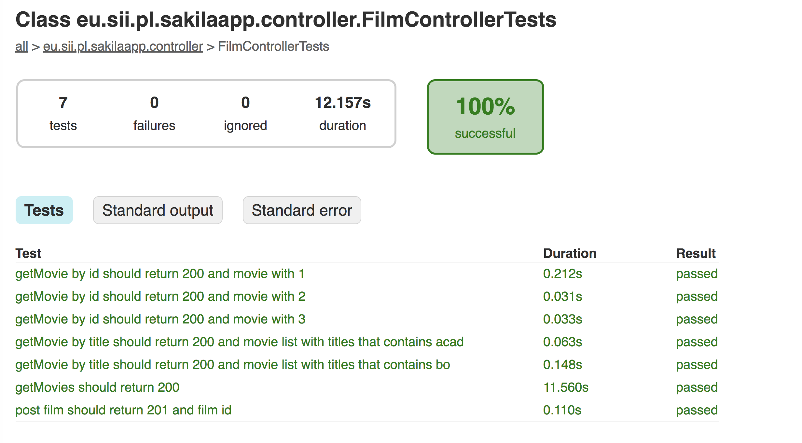
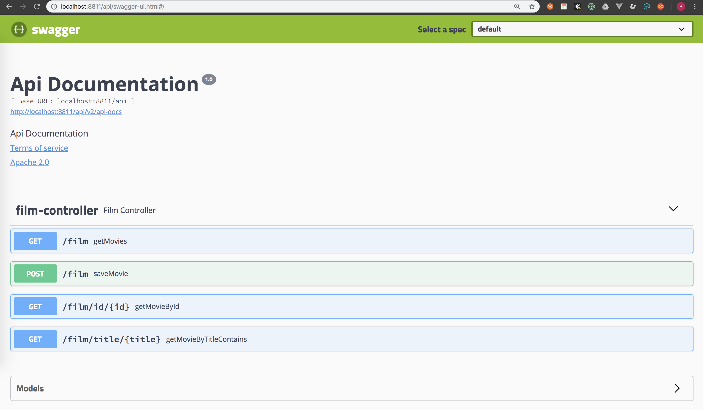
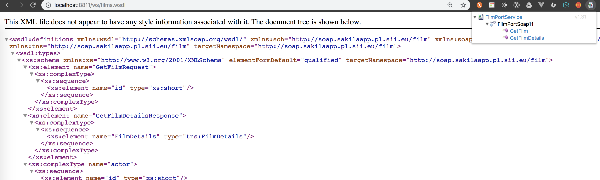
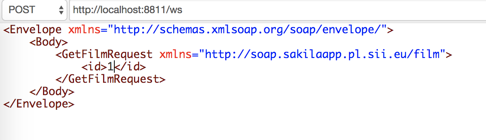
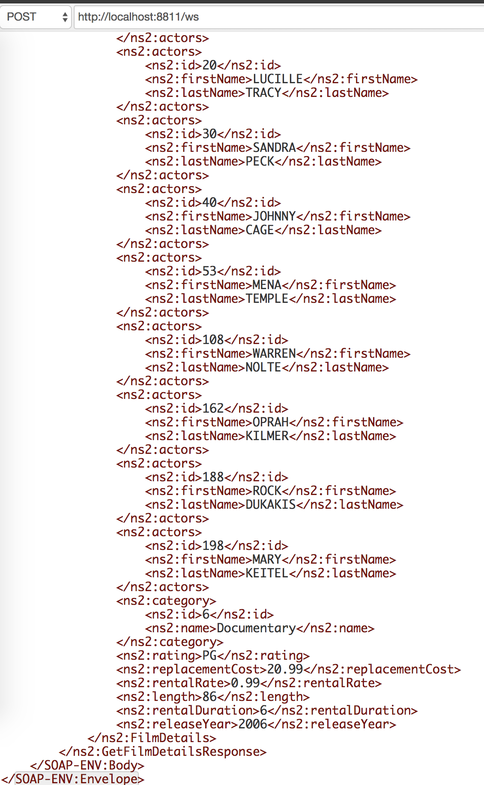

# SAKILA-APP

### Prerequisites

    JDK 1.8
    Docker-compose 1.22

## Build

    ./gradlew clean build

output folders:

JAR

    build/libs/sakila-app.jar

TESTS

    build/reports/tests/test/index.html
    build/test-results/test

## Run APP

Run is done with docker-compose.yml

    docker-compose up --build

and thats all.

MySQL is running on:

        container_name: sakila-db-fly
        image: mysql:5.7.23
        ports:
          - 3306:3306
        environment:
          MYSQL_DATABASE: "sakila"
          MYSQL_USER: "test"
          MYSQL_PASSWORD: "test"

APP is running on:

        container_name: sakila-app
        ports:
          - 8811:8811

## Swagger-UI

    http://localhost:8811/api/swagger-ui.html#/

## SOAP - Endpoints

    http://localhost:8811/ws/films.wsdl

download Wizdler - Chrome Plugin

open WSDL

select GetFilm

and send request

